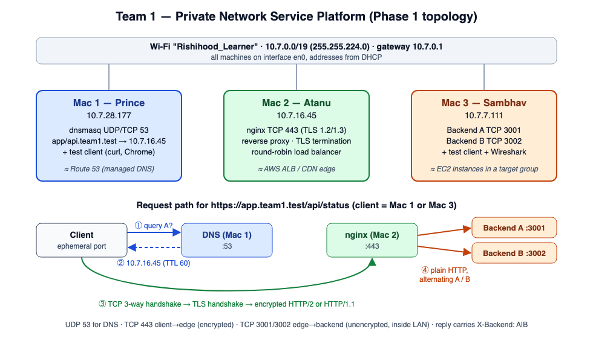

# Private Network Service Platform — Team 1

Computer Networks course project, **Phase 1: Build & Observe**.
A fully local private service on three macOS laptops: own DNS → HTTPS edge (nginx) → two load-balanced backends, with every step proven by `dig`, `curl -v`, Wireshark and browser DevTools.

> *The application stays simple — the network is the project.*



| Machine | Member | Role | IP | Service / port |
|---|---|---|---|---|
| Mac 1 | Prince Kumar Singh | Private DNS + test client | 10.7.28.177 | dnsmasq UDP/TCP 53 |
| Mac 2 | Atanu Adhikari | Edge: reverse proxy, TLS termination, load balancer | 10.7.16.45 | nginx TCP 443 |
| Mac 3 | Sambhav Kumar | Backend A + Backend B + test client + Wireshark | 10.7.7.111 | TCP 3001, TCP 3002 |

Domain: `app.team1.test`, `api.team1.test` → 10.7.16.45 · Network: Wi-Fi `Rishihood_Learner`, 10.7.0.0/19, gateway 10.7.0.1.

## Repository layout (mapped to spec section 9 deliverables)

```
.
├── README.md                     ← you are here
├── docs/
│   ├── Phase1_Report.md          ← Architecture document + Phase 1 report
│   ├── Video_Script.md           ← 3-member demo video script
│   ├── D3_Failure_Demo.md        ← form D3 answer (Option A) + run sheet
│   └── diagrams/topology.svg|png ← network topology + request flow
├── config/                       ← Configuration bundle
│   ├── mac1-dns/                 dnsmasq.conf + client DNS setup
│   └── mac2-edge/
│       ├── nginx/team1.conf      nginx reverse proxy / LB / TLS
│       └── tls/                  CA + server cert (public parts only) + setup notes
├── backend/                      ← Backend source code + launch instructions
│   └── backend.py
├── scripts/                      ← helper scripts (lb_test.sh, cache_test.sh)
└── evidence/                     ← Evidence folder
    ├── A-ping/  B-dns/  C-backends/  D-loadbalancing/
    ├── E-tls/   F-caching/  G-capture/
    └── failures/ 1-wrong-dns-server/ 2-wrong-dns-record/ 3-one-backend-stopped/
                  4-both-backends-stopped/ 5-wrong-port/
```

## Quick start

```bash
# Mac 1
sudo brew services restart dnsmasq
# Mac 3 (two windows)
python3 backend/backend.py A 3001
python3 backend/backend.py B 3002
# Mac 2
nginx -t && nginx
# any client Mac (Mac 3: use /usr/bin/curl)
dig app.team1.test
curl -v https://app.team1.test/api/status
./scripts/lb_test.sh
./scripts/cache_test.sh
```

Private keys are **not** in this repository (see `.gitignore`). They stay on Mac 2 only.

-- End of README.md --
